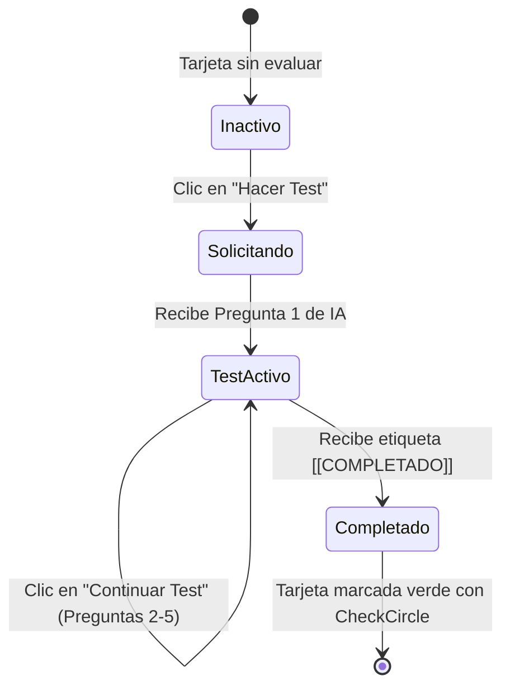

# 📝 Skill: Card Mini-Test Engine (Profesor Alquimia)

Esta **Skill** define la especificación, comportamiento pedagógico, estructura de prompts y contrato de estado para la función de **"Hacer Test" / "Continuar Test"** en las tarjetas de lección del LMS Alquimia.

---

## 🎯 1. Propósito Pedagógico
Permitir al estudiante autoevaluar su comprensión de una tarjeta específica mediante un **mini-test interactivo de 5 preguntas adaptativas** formuladas en tiempo real por el "Profesor Alquimia" a través del proxy de servidor `/api/cerebro` (n8n).

---

## 📋 2. Reglas Invariantes del Prompt

Cualquier invocación de mini-test generada por esta Skill **DEBE** incluir las siguientes reglas estrictas:

```text
Genérame un mini-test de exactamente 5 preguntas sobre "${block.titulo}".
REGLAS:
1. SIEMPRE EN ESPAÑOL.
2. USA SOLO el texto proporcionado de la tarjeta.
3. UNA pregunta a la vez, con 4 opciones estructuradas (a, b, c, d).
4. Tras cada respuesta del alumno: proporcionar feedback clínico/pedagógico breve + lanzar la siguiente pregunta con las 4 opciones estructuradas (a ,b, c, d).
5. Tras responder la pregunta 5: finalizar obligatoriamente emitiendo la etiqueta [[COMPLETADO]].

Texto de la tarjeta:
${block.contenido}
```

---

## 🔄 3. Ciclo de Vida del Estado de la Tarjeta



### Estados en el Frontend (`LessonContentViewer.tsx` / `chatStore.ts`):
1. **`isCompleted`** (`boolean`): Si la tarjeta ya ha finalizado su test exitosamente.
   - **UI:** Muestra botón verde deshabilitado con etiqueta `✓ COMPLETADO`.
2. **`isTesting`** (`boolean`): Si la tarjeta tiene una sesión de test actualmente abierta.
   - **UI:** Muestra botón azul animado con etiqueta `CONTINUAR TEST`.
3. **`chatLoading`** (`boolean`): Mientras la IA o el proxy `/api/cerebro` responden.
   - **UI:** Deshabilita botones temporalmente.

---

## 💻 4. Especificación del Manejador TypeScript

```typescript
const handleTestClick = async (block: CardBlock) => {
    const isContinuation = isTestActive && activeTestingCardId === block.id;

    if (isContinuation) {
        // Continuar sesión activa
        await sendMessage('Continúa con la siguiente pregunta del test.', {
            current_slug: unitName,
            isTestContinuation: true,
            isHidden: true,
            targetBlockId: block.id
        });
    } else {
        // Iniciar nuevo test
        const prompt = buildMiniTestPrompt(block.titulo, block.contenido);
        await sendMessage(prompt, {
            current_slug: unitName,
            isTestRequest: true,
            isHidden: true,
            blockContent: block.contenido,
            targetBlockId: block.id
        });
    }
};
```

---

## 🛡️ 5. Integración con Supabase Realtime & Reintentos

1. **Trigger de 3 Fallos Consecutivos:** Si el alumno falla 3 veces en un mini-test, el backend en Supabase (PL/pgSQL trigger `check_failed_attempts`) emite un evento en Supabase Realtime para notificar al equipo docente.
2. **Resiliencia de Red:** Si `/api/cerebro` no responde o sufre un timeout, la UI captura el estado 503 sin lanzar excepciones no controladas en consola.
