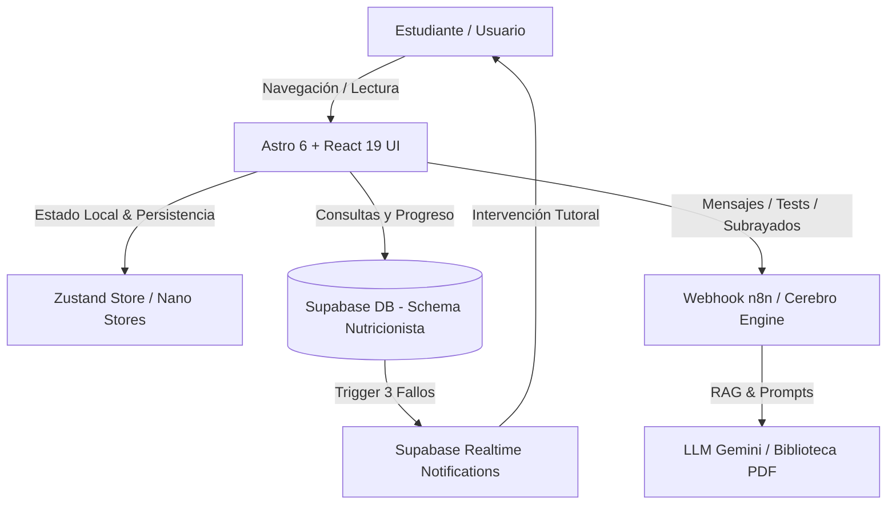
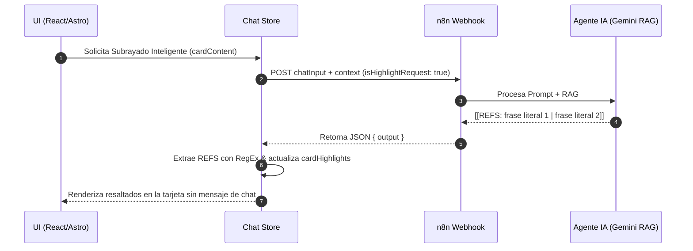

# Informe Exhaustivo del Proyecto LMS Alquimia
## Evaluación de 360° mediante el Método de los 3 Expertos

> [!NOTE]
> Este documento analiza en profundidad la plataforma **LMS Alquimia** (Sistema de Gestión del Aprendizaje para Nutrición y Dietética) mediante el **Método de los 3 Expertos**: Evaluación Técnica-Arquitectónica, Evaluación Pedagógica-UX EdTech, y Evaluación de IA/RAG-Automatización.

---

## 🏛️ 1. Diagnóstico General del Proyecto

**LMS Alquimia** es una plataforma educativa de alto impacto diseñada para la enseñanza intensiva de Nutrición y Dietética. Combina un motor web moderno basado en **Astro 6** y **React 19** con almacenamiento relacional y eventos en tiempo real en **Supabase**, además de un tutor inteligente ("Profesor Alquimia" / "Cerebro") orquestado mediante **n8n** y modelos LLM con arquitectura **RAG** sobre literatura científica en PDF.

---

## 👥 2. Evaluación por el Método de los 3 Expertos

---

### 👨‍💻 EXPERTO 1: Arquitectura de Software y Sistemas Full-Stack
**Rol:** *Senior Software Architect & Lead Full-Stack Engineer*

#### 1. Stack Tecnológico y Estructura
- **Core Framework:** [Astro 6.1](file:///workspaces/lmsalquimia/package.json#L39) configurado como híbrido con integración nativa de [React 19](file:///workspaces/lmsalquimia/package.json#L42). La separación de páginas estáticas/SSR en Astro y componentes interactivos de React mediante *islas (Islands)* garantiza tiempos de carga inicial sumamente rápidos.
- **Diseño & Estilos:** Utilización de [Tailwind CSS v4](file:///workspaces/lmsalquimia/package.json#L48) acoplado con `@tailwindcss/vite`, lo que provee compilación JIT ultra-rápida y soporte moderno para tokens CSS.
- **Gestión de Estado Dual:**
  - **Zustand 5.0:** Empleado en [chatStore.js](file:///workspaces/lmsalquimia/src/store/chatStore.js) para la gestión compleja del chat, sesiones de tests interactivos, subrayados automatizados y resúmenes; y en [quizStore.ts](file:///workspaces/lmsalquimia/src/store/quizStore.ts) con persistencia en `localStorage`.
  - **Nano Stores:** Utilizado en [uiStore.ts](file:///workspaces/lmsalquimia/src/store/uiStore.ts) para estados reactivos livianos entre componentes Astro y React.

#### 2. Base de Datos y Motor Relacional (Supabase)
En [schema.sql](file:///workspaces/lmsalquimia/supabase/schema.sql) y [books.ts](file:///workspaces/lmsalquimia/src/lib/books.ts#L36-L53):
- **Esquema Multitenant / Personalizado:** El sistema opera sobre el esquema `nutricionista`, abstrayendo datos como `documentos` y `pasos_completados`.
- **Lógica en Base de Datos (PL/pgSQL Trigger):** Destaca la función [`check_failed_attempts()`](file:///workspaces/lmsalquimia/supabase/schema.sql#L30-L56), la cual evalúa en tiempo de inserción si un estudiante acumula **3 intentos fallidos consecutivos** en la misma sesión y unidad, insertando automáticamente una alerta pedagógica en `lms_notifications`.
- **Realtime:** Activación de `supabase_realtime` sobre la tabla `lms_notifications` para notificaciones en vivo.

#### 3. Fortalezas y Puntos Críticos Técnicos

| Dimensión | Aspecto Destacado (Pro) | Área de Mejora (Riesgo / Deuda Técnica) |
| :--- | :--- | :--- |
| **Separación de Responsabilidades** | Excelente desacoplamiento entre UI ([LessonContentViewer.jsx](file:///workspaces/lmsalquimia/src/components/LessonContentViewer.jsx)) y capa de servicios ([books.ts](file:///workspaces/lmsalquimia/src/lib/books.ts)). | Reutilización de cadenas harcodeadas para `user_id` ('estudiante-demo') en lugar de autenticación Supabase Auth activa. |
| **Parsing de Contenidos** | Algoritmo determinista en [content.js](file:///workspaces/lmsalquimia/src/lib/content.js#L46-L105) para dividir Markdown/PDFs en bloques interactivos. | El generador de IDs para bloques utiliza `Date.now()`, lo que puede causar colisiones si se instancian múltiples bloques en el mismo milisegundo. |
| **Seguridad de API** | Configuración mediante variables de entorno `PUBLIC_N8N_CEREBRO_URL`. | Falta de firma JWT o tokens de sesión de un solo uso en las peticiones enviadas al Webhook de n8n. |

---

### 🎓 EXPERTO 2: Pedagogía EdTech, Diseño de Producto y UX/UI
**Rol:** *Director de Innovación Pedagógica & Lead UX/UI Designer*

#### 1. Experiencia de Aprendizaje Adaptativo (Learning Journey)
- **Micro-Learning mediante Tarjetas (Cards):** El sistema descompone temas largos en bloques navegables. Esto evita la fatiga cognitiva del estudiante de dietética frente a textos densos de bioquímica o fisiología.
- **Tutoría Proactiva por Fallos Repetidos:** La regla de los 3 fallos consecutivos en cuestionarios desencadena una notificación en tiempo real, transformando la evaluación en una oportunidad de soporte personalizado en lugar de una simple penalización.
- **Modos Práctica vs. Examen:** Gestionado en [quizStore.ts](file:///workspaces/lmsalquimia/src/store/quizStore.ts#L18), permitiendo feedback inmediato con explicaciones (*rationale*) o simulación de examen con temporización.

#### 2. Herramientas Interactivas de Estudio
- **Subrayado Inteligente Automatizado:** Mediante la acción `isHighlightRequest` en [chatStore.js](file:///workspaces/lmsalquimia/src/store/chatStore.js#L141-L153), la IA procesa el texto de una tarjeta y resalta las 15-20 frases clave, guiando la atención visual del estudiante.
- **Editor Rich Content para Creadores:** El componente de administración [DocumentEditor.jsx](file:///workspaces/lmsalquimia/src/components/admin/DocumentEditor.jsx) integra TipTap con extensiones de tablas, resaltado y atajos de formateo, facilitando la creación de contenidos de calidad por parte del cuerpo docente.
- **Planificación Temporal:** Inclusión de [GanttTimeline.jsx](file:///workspaces/lmsalquimia/src/components/GanttTimeline.jsx) y [FullCalendar.jsx](file:///workspaces/lmsalquimia/src/components/FullCalendar.jsx) para la estructuración del calendario de estudio.

#### 3. Evaluación Pedagógica

> [!TIP]
> **Pedagógicos Destacados:** La incorporación del "Profesor Alquimia" aporta una identidad narrativa fuerte ("la transmutación de alimentos en salud"), aumentando notablemente el *engagement* y la retención conceptual.

> [!WARNING]
> **Riesgo UX:** Si la respuesta de la IA en el panel lateral tarda más de 5 segundos, la ausencia de un esqueleto de carga (*skeleton loader*) detallado en la interfaz puede llevar al alumno a abandonar la tarjeta.

---

### 🤖 EXPERTO 3: Inteligencia Artificial, RAG y Automatización de Workflows
**Rol:** *AI System Architect & Prompt Engineer*

#### 1. Sistema de Agente y Personalidad (System Prompt)
En [ai_prompt.md](file:///workspaces/lmsalquimia/ai_prompt.md):
- **Identidad:** "Profesor de Alquimia", una voz académica, motivadora y basada en la evidencia científica.
- **Restricciones de Seguridad:** Prohibición explícita de ofrecer consejos médicos contrarios a las directrices de salud pública; instrucción obligatoria de derivar a consulta médica presencial.
- **Estructura Pedagógica de Respuesta:** Saludo -> Respuesta Directa RAG -> Contextualización -> Gema de Sabiduría -> Despedida.

#### 2. Protocolo de Comunicación y Parsing Estructurado
El motor [chatStore.js](file:///workspaces/lmsalquimia/src/store/chatStore.js#L104-L189) define un protocolo claro de comunicación con la IA vía n8n:
1. **Modo Test (Evaluar bloque):** Limita la respuesta a 1 pregunta de 4 opciones (a/b/c/d). Tras la 5ª pregunta emite la señal de control `[[COMPLETADO]]`.
2. **Modo Subrayado:** Fuerza la salida estructurada `[[REFS: frase 1 | frase 2 | ...]]`, permitiendo al cliente parsear expresiones sin romper la UI.
3. **Modo Resumen:** Genera resúmenes ejecutivos limitados a máximo 5 frases.

#### 3. Oportunidades y Riesgos en IA
- **Riesgo de Alucinación:** Mitigado por el *system prompt* estricto ("REGLAS: No inventes nada. Usa solo el contenido proporcionado"), pero depende de la calidad de los *chunks* vectorizados en la base de datos de n8n.
- **Inyección de Prompt:** Si el estudiante envía código o prompts maliciosos en la casilla de chat durante un test, se requiere una capa de *input sanitization* previa al webhook.

---

## 📊 3. Cuadro Comparativo de Hallazgos por Experto

| Dominio de Análisis | Fortaleza Principal | Vulnerabilidad o Limitación | Recomendación Clave |
| :--- | :--- | :--- | :--- |
| **1. Arquitectura & Backend** | trigger en PostgreSQL para alerta proactiva de fallos. | Falta de auth middleware global y presencia de `user_id` simulado. | Integrar Supabase Auth completo y RLS (Row Level Security). |
| **2. UX & Pedagogía EdTech** | Tarjetas de micro-learning con resaltado y resumen bajo demanda. | Falta de feedback visual sutil al autoguardar en el editor TipTap. | Añadir indicadores de estado "Guardado / Sincronizado". |
| **3. IA, RAG & Workflows** | Protocolo estricto con etiquetas de control (`[[REFS]]`, `[[COMPLETADO]]`). | Acoplamiento a una sola URL estática de webhook en n8n. | Implementar *fallback* o reconexión resiliente si n8n no responde. |

---

## 🚀 4. Hoja de Ruta Consolidada y Priorizada (Roadmap 360°)

### 🔴 Fase 1: Prioridad Alta (Estabilidad y Seguridad - 1 a 2 semanas)
1. **Autenticación y Seguridad (Supabase Auth & RLS):**
   - Reemplazar el usuario `estudiante-demo` por una sesión autenticada real con Supabase Auth en [books.ts](file:///workspaces/lmsalquimia/src/lib/books.ts#L35) y [schema.sql](file:///workspaces/lmsalquimia/supabase/schema.sql#L6).
   - Habilitar **Row Level Security (RLS)** en las tablas `quiz_attempts` y `lms_notifications`.
2. **Generación de IDs Únicos:**
   - Sustituir `Date.now()` en [content.js](file:///workspaces/lmsalquimia/src/lib/content.js#L56) por `crypto.randomUUID()` para evitar colisiones de clave en React.

### 🟡 Fase 2: Prioridad Media (Experiencia de Usuario e IA - 3 a 4 semanas)
1. **Mejora del Resiliencia del Webhook de IA:**
   - Añadir mecanismo de *retry* con retroceso exponencial en [chatStore.js](file:///workspaces/lmsalquimia/src/store/chatStore.js#L191-L203) ante caídas de la API de n8n.
2. **Progreso Visual y Gamificación:**
   - Visualización gráfica de retención del estudiante basada en los resultados de los tests y lecturas completadas (`pasos_completados`).

### 🟢 Fase 3: Prioridad Long-Term (Innovación EdTech - 2 a 3 meses)
1. **RAG Multimodal y Gráficos Nutricionales:**
   - Expandir la capacidad del Profesor Alquimia para analizar esquemas metabólicos (e.g. diagramas del ciclo de Krebs) mediante visión por ordenador en Gemini.
2. **Offline-First & PWA:**
   - Habilitar caché local de tarjetas mediante Service Workers para permitir lectura y realización de cuestionarios sin conexión.

---

## 📌 Conclusión General

El proyecto **LMS Alquimia** destaca por una **concepción técnica moderna y altamente diferenciada**. La fusión entre micro-learning interactivo, una sólida base de datos en Supabase con automatización por *triggers*, y un agente de IA con directivas pedagógicas claras mediante RAG lo posicionan como un producto EdTech con un potencial excepcional para la enseñanza de Nutrición y Dietética. Implementar las mejoras de seguridad y autenticación señaladas consolidará el proyecto como una solución de nivel producción.
