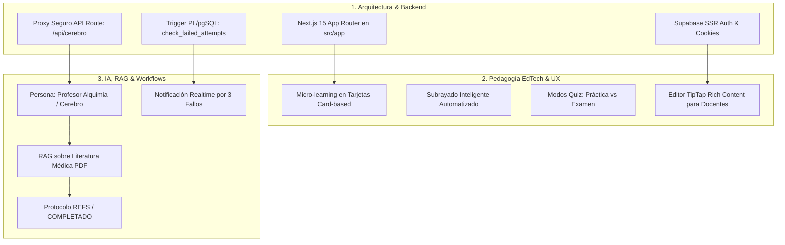

# 🧠 MEMORY.md — Banco de Memoria del Proyecto LMS Alquimia

> **Documento de Memoria Persistente para Agentes de IA y Desarrolladores**
> *Basado en [CONTEXT.md](file:///workspaces/lmsalquimia/CONTEXT.md) y [.github/audit/AUDIT.md](file:///workspaces/lmsalquimia/.github/audit/AUDIT.md)*

---

## 📌 1. Identidad del Sistema y Memoria Arquitectónica

- **Nombre del Sistema:** LMS Alquimia (`dimensional-doppler`)
- **Propósito:** Plataforma EdTech de aprendizaje intensivo y adaptativo en Nutrición, Dietética y Bioquímica.
- **Stack Consolidado:**
  - **Framework Full-Stack:** Next.js 15 (App Router en `src/app/`), React 19, **100% TypeScript (`.ts` / `.tsx`)**.
  - **Estilos & UI:** Tailwind CSS v4, Framer Motion, Lucide React icons.
  - **Backend & Base de Datos:** Supabase PostgreSQL (Esquema `nutricionista`, Supabase Realtime).
  - **Autenticación:** `@supabase/ssr` con cookies seguras basadas en servidor y middleware ([`middleware.ts`](file:///workspaces/lmsalquimia/middleware.ts)).
  - **Inteligencia Artificial & RAG:** Proxy de servidor en [`src/app/api/cerebro/route.ts`](file:///workspaces/lmsalquimia/src/app/api/cerebro/route.ts) hacia Webhook de n8n con modelo Gemini RAG sobre biblioteca PDF.

---

## 👥 2. Memoria Triangulada (Visión de los 3 Expertos)



---

## 🏛️ 3. Decisiones Clave e Invariantes del Proyecto

1. **Convención Única de Archivos (.ts / .tsx):**
   - **REGLA ABSOLUTA:** Todo código en `src/` se escribe exclusivamente en formato TypeScript (`.ts` para librerías/stores y `.tsx` para componentes React). Se han eliminado todos los archivos heredados `.astro`, `.jsx` y `.js`.
2. **Protocolo de Control por IA:**
   - Toda interacción con la IA que solicite frases clave DEBE respetar la salida en bloque `[[REFS: frase 1 | frase 2 | ...]]`.
   - Toda sesión de test finalizada con la IA DEBE emitir la etiqueta `[[COMPLETADO]]`.
3. **Seguridad de API:**
   - La comunicación con el Webhook n8n NUNCA debe hacerse directamente en el navegador del cliente; se canaliza a través de [`src/app/api/cerebro/route.ts`](file:///workspaces/lmsalquimia/src/app/api/cerebro/route.ts).
4. **Esquema Multitenant Supabase:**
   - Las consultas de contenidos y progreso DEBEN especificar el esquema `.schema('nutricionista')` en Supabase ([`src/lib/books.ts`](file:///workspaces/lmsalquimia/src/lib/books.ts)).

---

## 📜 4. Histórico de Hitos del Proyecto

| Fecha | Hito Alcanzado | Descripción y Archivos Impactados |
| :--- | :--- | :--- |
| **Inicial** | Motor Base LMS | Desarrollo inicial en Astro 6 + React híbrido. |
| **Auditoría** | Auditoría 360° | Ejecución del Método de los 3 Expertos en [.github/audit/AUDIT.md](file:///workspaces/lmsalquimia/.github/audit/AUDIT.md). |
| **Contexto** | Contexto Maestro | Creación de [CONTEXT.md](file:///workspaces/lmsalquimia/CONTEXT.md) para agentes de IA. |
| **Migración** | Next.js 15 + Supabase SSR | Reestructuración a `src/app/`, React 19, TypeScript estricto, `@supabase/ssr` y `/api/cerebro`. |
| **Convención** | 100% TypeScript TSX | Conversión completa de componentes a `.tsx` y helpers a `.ts`. Eliminación de `.astro` y `.jsx`. |

---

## 🌳 5. Estructura de Archivos (100% TypeScript)

```text
/workspaces/lmsalquimia/
├── memory/
│   └── MEMORY.md                   # Banco de memoria del sistema (Este archivo)
├── .github/
│   └── audit/
│       └── AUDIT.md                # Informe de auditoría 360° (3 expertos)
├── CONTEXT.md                      # Contexto maestro del proyecto
├── ai_prompt.md                    # System Prompt del Profesor Alquimia
├── package.json                    # Next.js 15, React 19, Tailwind v4
├── tsconfig.json                   # TypeScript estricto con alias @/* -> ./src/*
├── middleware.ts                   # Supabase Auth SSR Middleware global
└── src/
    ├── app/                        # Next.js 15 App Router
    │   ├── layout.tsx              # Root Layout con 3 paneles y SSR Auth
    │   ├── page.tsx                # Redirección a /dashboard
    │   ├── globals.css             # Estilos globales Tailwind v4
    │   ├── dashboard/page.tsx      # Centro de mando del estudiante
    │   ├── leccion/[...path]/page.tsx # Visor dinámico de lecciones por slug
    │   ├── biblioteca/page.tsx     # Explorador de biblioteca
    │   ├── evaluacion/page.tsx     # Motor de cuestionarios adaptativos
    │   ├── historial/page.tsx      # Historial de actividades
    │   ├── planificacion/page.tsx  # Timeline Gantt
    │   ├── calendario/page.tsx     # FullCalendar
    │   ├── admin/page.tsx          # Editor TipTap de docentes
    │   ├── admin/calendario/page.tsx # Gestión de calendario admin
    │   ├── login/page.tsx          # Autenticación Supabase Auth SSR
    │   ├── auth/callback/route.ts  # Handler OAuth/Magic Links
    │   └── api/cerebro/route.ts    # Proxy API seguro para Webhook de n8n
    ├── components/
    │   ├── SidebarHierarchy.tsx    # Menú lateral con Supabase Realtime (.tsx)
    │   ├── LibraryExplorer.tsx     # Explorador de biblioteca (.tsx)
    │   ├── LessonContentViewer.tsx # Micro-tarjetas con IA (.tsx)
    │   ├── ChatSidebar.tsx         # Chat del Profesor Alquimia (.tsx)
    │   ├── ChatDrawer.tsx          # Drawer lateral (.tsx)
    │   ├── FloatingChat.tsx        # Chat flotante (.tsx)
    │   ├── AIStudyButton.tsx       # Botón invocador IA (.tsx)
    │   ├── Calendar.tsx            # Mini calendario (.tsx)
    │   ├── FullCalendar.tsx        # Calendario integral (.tsx)
    │   ├── GanttTimeline.tsx       # Gráfico Gantt (.tsx)
    │   ├── SidebarCollapseButton.tsx # Botón colapsable (.tsx)
    │   ├── admin/
    │   │   ├── AdminProtectedRoute.tsx # Protector de ruta (.tsx)
    │   │   ├── DocumentEditor.tsx      # Editor TipTap (.tsx)
    │   │   ├── LoginForm.tsx           # Formulario login admin (.tsx)
    │   │   └── RichCardEditor.tsx      # Editor de tarjetas (.tsx)
    │   └── quiz/
    │       ├── QuizEngine.tsx          # Motor de quiz (.tsx)
    │       ├── QuestionCard.tsx        # Tarjeta de pregunta (.tsx)
    │       ├── SubjectSelector.tsx     # Selector de materias (.tsx)
    │       ├── DifficultySelector.tsx  # Selector de dificultad (.tsx)
    │       └── ProgressBar.tsx         # Barra de progreso (.tsx)
    ├── lib/
    │   ├── books.ts                # Consultas a esquema 'nutricionista'
    │   ├── content.ts              # Algoritmo de desfragmentación en tarjetas
    │   ├── tracking.ts             # Tracking de eventos
    │   ├── supabase.ts             # Singleton cliente Supabase
    │   └── supabase/               # Clientes SSR (server.ts, client.ts, middleware.ts)
    └── store/
        ├── chatStore.ts            # Zustand TypeScript: Chat e IA
        ├── quizStore.ts            # Zustand TypeScript: Cuestionarios
        └── uiStore.ts              # Zustand TypeScript: Interfaz UI
```
