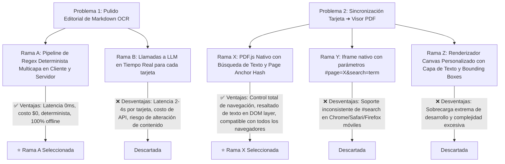
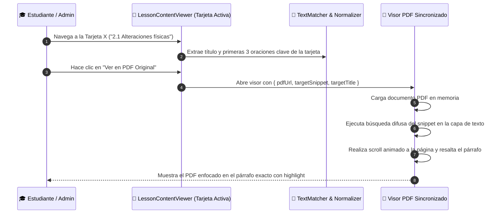

# 📋 Implementation Plan: Pulido Editorial de Markdown & Sincronización Inteligente de Tarjetas con Visor PDF

---

## 🧭 1. Resumen Ejecutivo y Clasificación de Complejidad

- **Objetivo General:**
  1. **Motor de Pulido y Tipografía Editorial**: Elevar la calidad del texto en las tarjetas eliminando todos los artefactos de OCR/PDF (patrones rotos como `• *VENTAJAS: **-`, asteriscos sueltos `**/**`, negritas inconsistentes y listas fusionadas) transformándolos en Markdown semántico limpio (H3/H4, listas con viñetas reales y negritas canónicas).
  2. **Sincronización Contextual Tarjeta $\leftrightarrow$ Visor PDF Original**: Implementar una experiencia donde el sistema detecte la tarjeta activa del estudiante/admin y, al abrir el visor de PDF, navegue automáticamente a la página correspondiente y localice/resalte el fragmento de texto original.

- **Nivel de Complejidad (según `code-refinement-suite`):** **Nivel 2 / Nivel 3 (Medio-Alto)**.
  - Involucra algoritmos de procesamiento de lenguaje natural / regex tipográfico, integración con visor de PDF (`pdfjs` / `react-pdf` / visor embebido) con búsqueda de texto (`findController` / fragment matching) y persistencia en frontend/backend.

---

## 📐 2. PACK 1: ARCHITECT (Ideación & Tree of Thoughts)

### Árbol de Pensamiento (Tree of Thoughts - ToT)

### Evaluación según el Método de los 3 Expertos

| Criterio | Solución Propuesta | Valoración Experto |
| :--- | :--- | :--- |
| **Experto UX/UI** | Markdown tipográfico de alta legibilidad + Visor PDF sincronizado en split-screen / modal con resaltado amarillo fluorescente en el texto fuente. | **Excelente:** Elimina fricción cognitiva. El estudiante puede contrastar al instante la tarjeta con la fuente original del libro sin perder tiempo buscando la página. |
| **Experto Dev Lead** | `codeFormatter.ts` enriquecido con AST/Pipeline determinista + Visor PDF con `pdfjs-dist` o Iframe inteligente con `PDFViewerApplication.findController`. | **Excelente:** Arquitectura desacoplada, tipada con TypeScript, reactiva y sin dependencias pesadas innecesarias. |
| **Experto Seguridad** | Sanitización estricta de HTML mediante `rehypeSanitizeEventHandlers` y control de URLs seguras en Storage de Supabase. | **Excelente:** Cero riesgo de XSS en renderizado de Markdown enriquecido; tokens de lectura firmados para Storage. |

---

## �� 3. PACK 2: PLANNER (Abstracción & Self-Refinement Loop)

### Diagrama de Secuencia: Flujo de Sincronización Tarjeta $\rightarrow$ PDF

---

### Ciclos de Auto-Refinamiento (Self-Refinement Loop - 3 Ciclos)

#### 🔄 Ciclo 1: Refinamiento del Motor Tipográfico (`codeFormatter.ts`)
- **Regla 1: Corrupción de Viñeta + Negrita + Guión**:
  - Transformar `• *VENTAJAS: **-  Texto` o `- *VENTAJAS: **- Texto` $\rightarrow$ `- **VENTAJAS:** Texto`.
- **Regla 2: Encabezados en Mayúsculas con Asteriscos**:
  - Transformar `*HISTORIA DEL APPC**` o `**historia del appc**` en líneas aisladas $\rightarrow$ `### Historia del APPCC`.
- **Regla 3: Signos Huérfanos y Símbolos de OCR**:
  - Eliminar `**/**`, `\*\*/\*\*`, barras invertidas erróneas, dobles dos puntos `::` y caracteres de separación inválidos.
- **Regla 4: Definiciones y Términos Técnicos**:
  - Normalizar `*Concepto:*` o `*Concepto:**` $\rightarrow$ `**Concepto:**`.
- **Regla 5: Sangrías y Espaciado de Listas**:
  - Garantizar que después de cada dos puntos seguido de viñeta (`:\n- `), haya salto de línea semántico para que Tailwind Typography (`prose`) lo formatee como lista ordenada/desordenada limpia.

#### 🔄 Ciclo 2: Sincronización Inteligente de Contexto Tarjeta $\leftrightarrow$ PDF
- **Extracción de Ancla de Texto (Search Anchor)**:
  - Crear una función helper `extractCardSearchAnchor(card: LessonBlock): { keywords: string[], searchSnippet: string }` que seleccione las palabras clave más distintivas (3 a 6 palabras) del inicio del bloque, omitiendo palabras comunes.
- **Componente Visor PDF Mejorado (`PdfSyncViewer.tsx`)**:
  - Visor modal o panel lateral sincronizado.
  - Cuando se monta o cambia la tarjeta activa, ejecuta `findController.executeCommand('find', { query: searchSnippet, highlightAll: true, findPrevious: false })` o utiliza el visor de PDF con renderizado de capa de texto (`TextLayer`).
  - Botón de alternancia rápida: *"Ir a la tarjeta actual en el PDF"*.

#### 🔄 Ciclo 3: Integración en Vista Estudiante y Panel Admin
- Actualizar `LessonContentViewer.tsx` y `DocumentEditor.tsx` para exponer el estado de la tarjeta activa (`activeBlock`) y el botón con icono de documento *"Ver fuente original"* sincronizado.
- Actualizar `LessonCard.tsx` con estilos tipográficos refinados (`prose-strong:text-slate-900`, `prose-h3:text-slate-800`, `prose-li:my-1`).

---

## 📂 4. Plan de Modificaciones por Archivos

| Fase | Archivo | Acción | Propósito |
| :---: | :--- | :---: | :--- |
| **1** | `src/lib/codeFormatter.ts` | 🟡 Modificar | Implementar el pipeline de limpieza avanzada de OCR (viñetas con asteriscos, signos huérfanos `**/**`, títulos H3/H4 y negritas canónicas). |
| **2** | `src/lib/pdfSync.ts` | 🟢 Crear | Lógica de extracción de fragmentos ancla (snippets) y cálculo de coincidencias difusas para localización de tarjetas en PDF. |
| **3** | `src/components/pdf/PdfSyncViewerModal.tsx` | 🟢 Crear | Componente modal/drawer del PDF original con búsqueda automática del fragmento de la tarjeta activa y resaltador visual. |
| **4** | `src/components/lesson/components/LessonCard.tsx` | 🟡 Modificar | Aplicar el formateo visual pulido y agregar botón discreto *"Ver en PDF"* en el header de cada tarjeta. |
| **5** | `src/components/lesson/LessonContentViewer.tsx` | 🟡 Modificar | Conectar el estado de la tarjeta activa con el modal `PdfSyncViewerModal`. |
| **6** | `src/components/admin/DocumentEditor.tsx` | 🟡 Modificar | Sincronizar el visor de PDF del panel admin para que al hacer clic en una tarjeta en el editor, el PDF del lateral salte al párrafo correspondiente. |

---

## 🧪 5. Estrategia de Pruebas (Test Plan)

1. **Pruebas de Formateo Tipográfico:**
   - [ ] Entrada: `• *VENTAJAS: **-  Garantiza la seguridad alimentaria.` $\rightarrow$ Salida esperada: `\n- **VENTAJAS:** Garantiza la seguridad alimentaria.`
   - [ ] Entrada: `*HISTORIA DEL APPC**` $\rightarrow$ Salida esperada: `### Historia del APPCC` o `**Historia del APPCC**`.
   - [ ] Entrada: `Texto con **/** y signos huérfanos.` $\rightarrow$ Salida esperada: `Texto con signos huérfanos.` sin marcas residuales.
   - [ ] Entrada: Párrafo de 4 oraciones $\rightarrow$ Justificado sin saltos de línea irregulares.

2. **Pruebas de Sincronización PDF:**
   - [ ] Estar en la Tarjeta 15 de una unidad $\rightarrow$ Clic en *"Ver en PDF"* $\rightarrow$ El visor abre directamente en la página de la Tarjeta 15 y resalta el texto correspondiente.
   - [ ] Cambiar de tarjeta con las flechas del teclado $\rightarrow$ El visor PDF actualiza el foco al nuevo fragmento.

3. **Pruebas de Compilación:**
   - [ ] `npm run build` exitoso con código 0 en todas las rutas.

---

## 🛑 6. Regla Inviolable de Control de Git
- [ ] No ejecutar `git push` automáticamente.
- [ ] Presentar el resumen de cambios al usuario y esperar su confirmación explícita.
